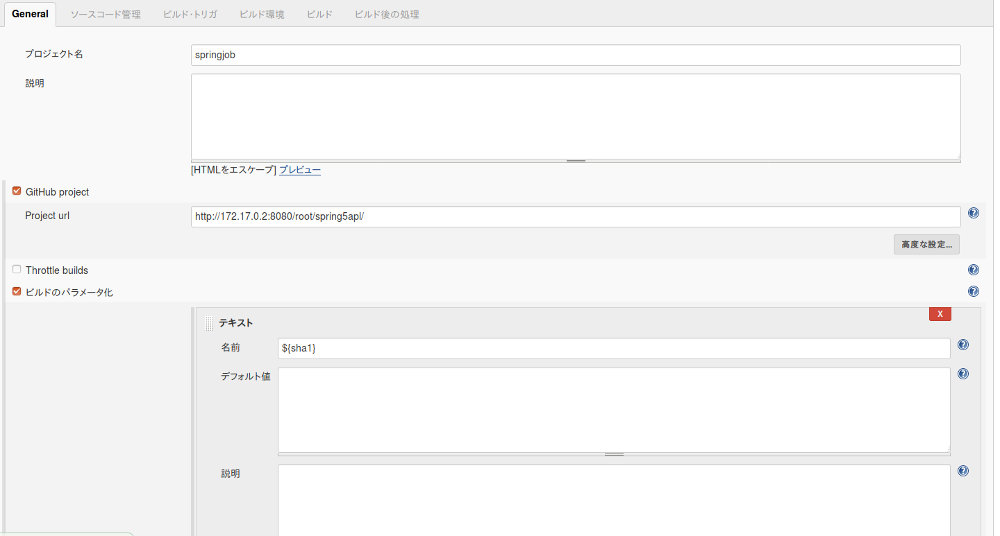

# gitbucket-jenkins

参考サイト  
gitbucketとjenkinsをGitHubPullRequestBuilderを使って連携する  
https://qiita.com/hikaruworld@github/items/ae2cdc1904d7d35ef0b8  

## プラグインの管理

## jenkinsの設定

## ジョブ設定

## Gitbucket Service Hooks

