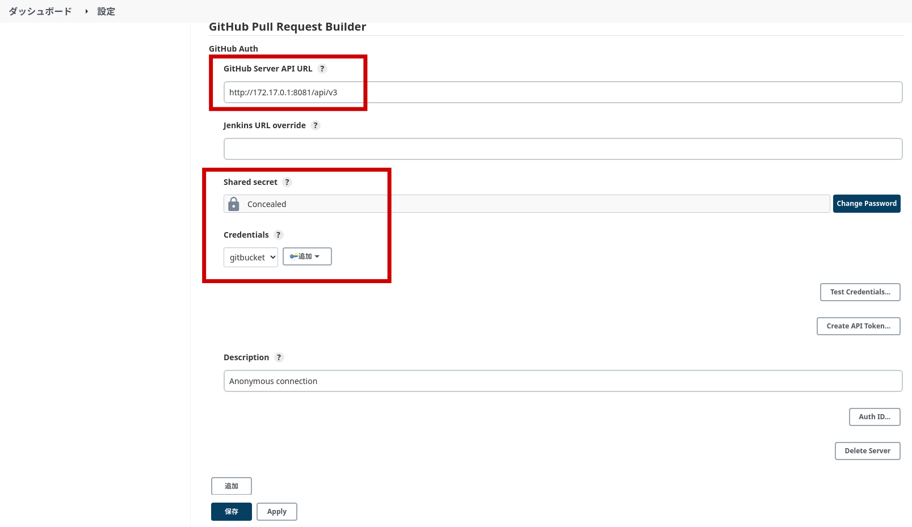
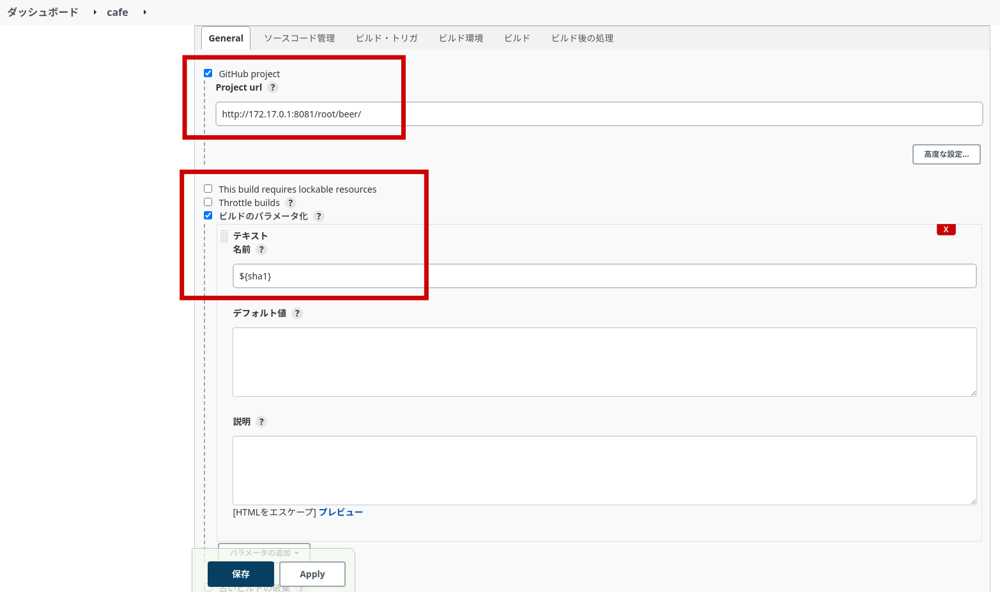
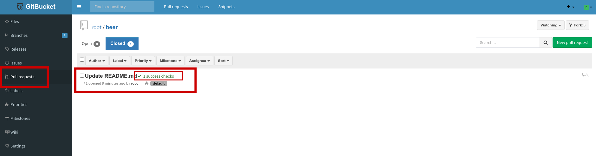

# gitbucket-jenkins

## 参考サイト  
gitbucketとjenkinsをGitHubPullRequestBuilderを使って連携する  
https://qiita.com/hikaruworld@github/items/ae2cdc1904d7d35ef0b8  

【Jenkins】GitHub のプルリクをトリガーにジョブをビルドする方法  
https://baba-s.hatenablog.com/entry/2021/05/14/090000  

## 環境
ローカルマシン上にDockerでjenkinsとgitbucketを起動  

### jenkinsサーバ  
docker起動コマンド  
* docker run -p 8080:8080 -p 50000:50000 jenkins/jenkins:lts-jdk11  
URL  
* 172.17.0.1:8080/  

### gitbucketサーバ 
docker起動コマンド   
* docker run -d -p 8081:8080 gitbucket/gitbucket  
URL  
* 172.17.0.1:8081/  

## jenkinsプラグインの管理
GitHub Pull Request Builderプラグインをインストールする  

## Gitbucket Personal access tokens生成
jenkinsがビルド結果の反映時に使用するgitbucketユーザのアクセストークンを生成し、jenkins側に設定する  

## jenkinsシステムの設定(GitHub Pull Request Builderプラグインの設定)
gitbucketサーバのURL設定、gitbucketユーザのアクセストークン設定（生成したもの）  

## jenkinsジョブ設定
gitbucketリポジトリの登録（URL、ビルドのパラメータ化、Refspec、ビルドブランチ、ビルドトリガ）  

## Gitbucket Service Hooks設定
都度プルリク作成が行われたタイミングで、jenkins側へ通知を行う設定  

## 動作確認
動作確認として、プルリク作成を行い少し待つと、自動的にjenkinsジョブが開始される  
jenkinsジョブ実行が完了すると、プルリクにjenkinsビルド結果(成功、失敗)が反映される  

